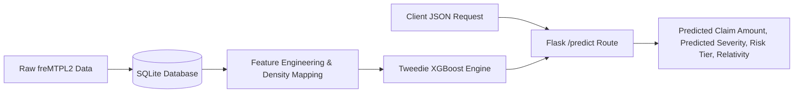

# Risk-Scoring API: Tweedie GLM vs. XGBoost

## Table of Contents
* [Overview](#overview)
* [Project Structure](#project-structure)
* [The API](#the-api)
* [Running Locally](#running-locally)
* [Engineering Decisions & Troubleshooting Log](#engineering-decisions--troubleshooting-log)
* [Current Limitations & V2 Roadmap](#current-limitations--v2-roadmap)

## Overview
This project predicts insurance claim severity using the French Motor Third-Party Liability claims dataset (`freMTPL2`). It builds an end-to-end pipeline that ingests data via SQLite, evaluates a fine tuned Generalized Linear Model (Tweedie Regressor) and XGBoost regressor, and returns predictions via a production Flask API.

## Project Structure
* `data/`: Local directory for raw datasets (`freMTPL2freq.csv`, `freMTPL2sev.csv`) and SQLite database (`risk_model.db`).
* `sql/`: SQLite database setup scripts and data aggregation queries.
* `model_training/`: Jupyter notebook (`model_creation.ipynb`) containing Exploratory Data Analysis, feature engineering, and model evaluation.
* `production_api/`: Flask application (`app.py`) and serialized model artifacts (`.pkl`).
* `test_script.py`: Local test script to validate multi-profile API responses.

## The API
The Flask API accepts JSON payloads containing applicant driver data, handles categorical mapping and one-hot encoding internally, and returns four key metrics:

* **Predicted Claim Amount (USD)**: Model prediction output.
* **Pure Premium Relativity**: Multiplier comparing applicant risk against baseline portfolio average.
* **Risk Severity Score (1-100)**: Scaled score for rapid underwriting assessment.
* **Risk Tier**: Tiered classification ranging from Tier 0 (Low Risk) to Tier 5 (Extreme Outlier).

### Example API Response
```json
{
    "status": "success",
    "Predicted Business Risk Level": "Tier 2: Elevated Risk",
    "Predicted Claim Amount_USD": 215.35,
    "Pure Premium Relativity": 1.28,
    "Risk Severity Score 1-100": 18.5
}
```

## Running Locally

### Clone the repository:
```bash
git clone [https://github.com/brennanq1/GLM-vs-XGB-Risk-Scoring-Model.git](https://github.com/brennanq1/GLM-vs-XGB-Risk-Scoring-Model.git)
cd GLM-vs-XGB-Risk-Scoring-Model
```

### Install dependencies:
```bash
pip install -r requirements.txt
```

### Start the Flask Server:
```
python production_api/app.py
```

### Run the Test Script:
```bash
python test_script.py
```

## Engineering Decisions & Troubleshooting Log

### 1. Key Technical Decisions & Trade-Offs

#### Decision 1: Model Selection — Tweedie GLM vs. Tweedie XGBoost
* **Context:** Predicting claim amounts on auto insurance loss data (`freMTPL2`) where most policyholders have zero claims (zero-inflated) and values are heavily right-skewed.
* **Options:** Generalized Linear Model (GLM) with a Tweedie distribution and log-link vs. XGBoost Regressor using Tweedie loss (`reg:tweedie`).
* **Trade-Offs:**
  * *Tweedie GLM:* Produces clear, multiplicative rating factors that are straightforward to explain and submit for rate filings, but cannot capture multi-variable interactions without manually engineered features.
  * *Tweedie XGBoost:* Automatically identifies non-linear relationships across driver and vehicle attributes to reduce prediction error (MAE/RMSE), but functions as a less transparent model.
* **Outcome:** Used the Tweedie GLM as a clear baseline pricing model and deployed the tuned XGBoost model to the API for final risk scoring and predictions.

#### Decision 2: Decoupling SQL Scripts from Jupyter Notebooks
* **Context:** Creating tables and the aggregate modeling view (`risk_model_view`) for policy and claim records.
* **Options:** Hardcoding multi-line SQL strings inside notebook cells vs. storing SQL statements in standalone `.sql` files and executing them via Python.
* **Trade-Offs:**
  * *In-Notebook SQL:* Fast to set up initially, but clutters notebook cells, hides database changes inside notebook files, and makes reusing schema code difficult.
  * *Standalone `.sql` Files:* Requires a few lines of Python file-reading code, but keeps database logic in one place, supports standard SQL editing tools, and keeps the notebook focused on modeling.
* **Outcome:** Moved all table and view definitions into `sql/01_schema_setup.sql` and `sql/risk_model.sql`, loading and running them in Python using `cursor.executescript()`.

#### Decision 3: In-API Data Preprocessing vs. Client-Side Preprocessing
* **Context:** Serving live predictions on applicant records through a Flask endpoint (`/predict`).
* **Options:** Requiring clients to send pre-encoded feature arrays vs. accepting raw JSON applicant fields and processing them inside Flask.
* **Trade-Offs:**
  * *Client-Side:* Keeps API route logic minimal, but requires client applications to know the exact one-hot encoding columns and ordering used during training.
  * *In-API:* Adds validation and encoding logic to Flask, but allows clients to send readable, raw applicant data (like car brand and region names).
* **Outcome:** Added input checking, category mapping, and one-hot encoding directly inside `app.py` before running model inference.


## Current Limitations & V2 Roadmap

### Current Limitations
* **Single Compound Target Limitation**: Training a single Tweedie regressor directly on claim amounts causes predictions to be heavily driven by historical claim count (`ClaimNb`), resulting in lower risk differentiation for zero-claim policyholders.
* **Database Concurrency**: The current SQLite backend is lightweight and file-based, making it ideal for local testing but limited for high-concurrency production workloads.
* **Feature Scope**: The feature space relies on static driver/vehicle attributes and density-mapped area codes, without incorporating external geographic, telematics, or real-time traffic data.

### Version 2 Roadmap
* **Two-Part Frequency-Severity Architecture**: Transition from a single Tweedie regressor to a two-part hurdle pipeline:
  * **Frequency Model**: Poisson or Negative Binomial GLM/GBDT to predict expected annual claim frequency per unit of exposure.
  * **Severity Model**: Gamma or Lognormal GLM/GBDT trained strictly on positive loss records to predict average cost per claim.
  * **Pure Premium Integration**: Combine both models ($\text{Pure Premium} = \text{Frequency} \times \text{Severity}$) to improve pricing differentiation across zero-loss drivers.
* **Database & Pipeline Upgrades**: Migrate the SQLite layer to PostgreSQL for multi-user transactional workloads and transition SQL execution to automated migration tools (e.g., Alembic).
* **Containerization & CI/CD**: Dockerize the Flask microservice and build GitHub Actions workflows to automate unit testing, linting, and regression checks on push.
